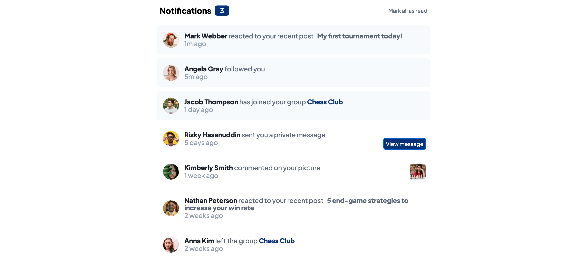

# Frontend Mentor - Notifications page solution

This is a solution to the [Notifications page challenge on Frontend Mentor](https://www.frontendmentor.io/challenges/notifications-page-DqK5QAmKbC). Frontend Mentor challenges help you improve your coding skills by building realistic projects. 

## Table of contents

- [Overview](#overview)
  - [The challenge](#the-challenge)
  - [Screenshot](#screenshot)
  - [Links](#links)
- [My process](#my-process)
  - [Built with](#built-with)
  - [What I learned](#what-i-learned)
  - [Continued development](#continued-development)
- [Author](#author)
- [Acknowledgments](#acknowledgments)

## Overview

### The challenge

Users should be able to:

- Distinguish between "unread" and "read" notifications
- Select "Mark all as read" to toggle the visual state of the unread notifications and set the number of unread messages to zero
- View the optimal layout for the interface depending on their device's screen size
- See hover and focus states for all interactive elements on the page

### Screenshot

Then crop/optimize/edit your image however you like, add it to your project, and update the file path in the image above.

### Links

- Solution URL: [Add solution URL here](https://your-solution-url.com)
- Live Site URL: [Add live site URL here](https://nyrellcl.github.io/notifications-challenge/)

## My process

### Built with

- Semantic HTML5 markup
- CSS custom properties
- Flexbox
- Mobile-first workflow
- [React](https://reactjs.org/) - JS library
- Visual Studio Code
- SASS/SCSS CSS pre-processors

### What I learned

I wanted to more practice creating projects using React and its features. For this project, the user stories were a great start to using React features. Since the users need to be able to distinguish between read and unread messages, this was a good part to practice useState() hook in React. Working with useState() allows me to practice creating dynamic UI's and also have more practice with JavaScript.

The challenges that I faced was getting the notfication number and the notifications to go from a notification, to a non-notification when the user clicks on "Mark all read"
I'm still working on this feature, I'm sure it has a really simple solution, but figuring it out on my own will provide a great learning experience in the end. 

I also learned a lot about scalability, I didn't just want to complete this challenge, I wanted to make it my own and add even just a small feature that could potentially have a positive effect on the UI and UX for the user. 

Therefore, I added a "view message" button for when another user send the primary user a message. I thought this was necessary for the purpose of privacy. It's possible the user doesn't want any of their messages form others to be displayed right away. So, a view message button that allows them to toggle the contents of the message after the fact, could improve the user experience. 

### Continued development

I really want to become better at creating much more complex problems, that need more complex features and solutions. But, by completing challenges like this, I will be able to gradually progress into more complex challenges and solutions. Thus, making me more prepared for when I interview and work in a professional environment. 

I also need to develop a more straightforward and clear path of how I go about designing before actually developing projects. I find myself just mentally mapping out the design and not physically putting down the design sketch. 

**Note: Delete this note and the content within this section and replace with your own plans for continued development.**

## Author

- Website - [Nyrell Leonor](https://www.nyrellcl.com)
- Frontend Mentor - [@nyrellcl](https://www.nyrellcl.io/profile/yourusername)

## Acknowledgments

I give credits to Web Dev Cody on youtube. He's the channel I primarily used when referencing how to use certain react features and how to go about designing a project before even developing it. 

